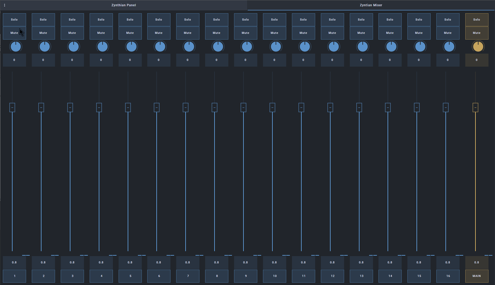
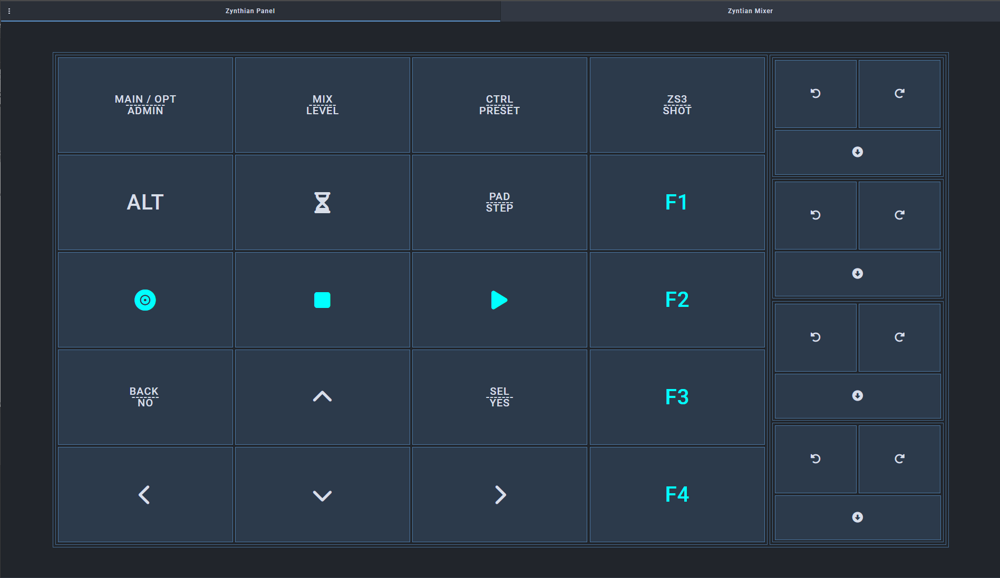
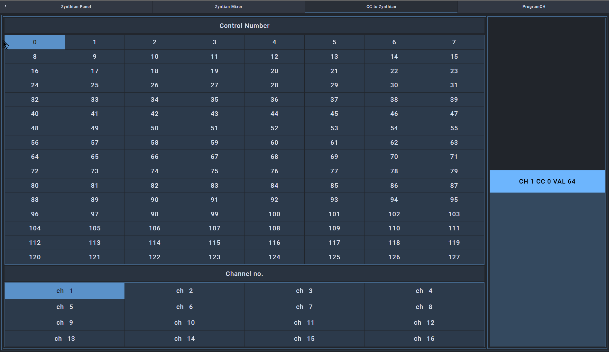
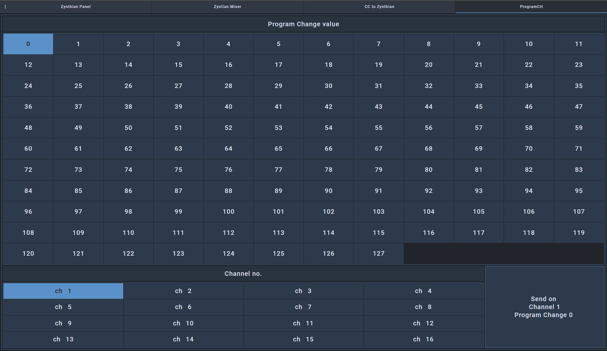

# Zynthian-OSC  
Template for Open Stage Control with control of the Zynthian synth. With these templates, you can control Zynthian using a mobile device.

## Prerequisites  

A functional computer running the Open Stage Control Server – available for download at [Open Stage Control](https://openstagecontrol.ammd.net/download/), where you can also find the installation guide. In my case, the Open Stage Control Server is installed on a Raspberry Pi 4 and launched using Node. The computer must have a working network connection; otherwise, it will not connect to the Zynthian. I have not tested installing the Open Stage Control Server directly on the Zynthian.

If you want to use templates that send MIDI Control Change and Program Change commands, you must have an active MIDI connection between the Zynthian and your computer running the Open Stage Control Server. It is advisable to use tools such as **QMidiNet** or **RTP-MIDI**, as they enable network-based connections. Additionally, the relevant service must be enabled in the Zynthian settings to establish the connection.

## Mixer Template  

  

Download the files from the `./source/Mixer` directory.

1. Edit `mixer.js` – change  
   ```js
   var zyn_host = '192.168.88.102'
   ```
   to the correct address of your Zynthian.
2. Start the OSC server using the following command (on Raspberry Pi):

   ```sh
   node /path/to/open-stage-control_1.22.0_node 
   -s 192.XXX.YYY.ZZZ:1370
   -l /path/to/dir/Mixer/mixer.json
   -c /path/to/dir/Mixer/mixer.js
   --osc-port 1370
   ```
   
   Replace `192.XXX.YYY.ZZZ` with your Zynthian's IP address.

## Panel Template  

  

Download the files from the `./source/Panel` directory.

1. Edit `panel.js` – change  
   ```js
   var sw_zyn_host = '192.168.88.102'
   ```
   to the correct address of your Zynthian.
2. Start the OSC server using the following command (on Raspberry Pi):

   ```sh
   node /path/to/open-stage-control_1.22.0_node 
   -s 192.XXX.YYY.ZZZ:1370
   -l /path/to/dir/Panel/panel.json
   -c /path/to/dir/Panel/panel.js
   --osc-port 1370
   ```

   Replace `192.XXX.YYY.ZZZ` with your Zynthian's IP address.

## Mixer + Panel Template  

This template combines the previous two and allows you to control all Zynthian functions.

Download the files from the `./source/Mixer+Panel` directory.

1. Edit `mixer.js` – change  
   ```js
   var zyn_host = '192.168.88.102'
   ```
   to the correct address of your Zynthian.
2. Edit `panel.js` – change  
   ```js
   var sw_zyn_host = '192.168.88.102'
   ```
   to the correct address of your Zynthian.
3. Start the OSC server using the following command (on Raspberry Pi):

   ```sh
   node /path/to/open-stage-control_1.22.0_node 
   -s 192.XXX.YYY.ZZZ:1370
   -l /path/to/dir/Mixer+Panel/zynthian.json
   -c /path/to/dir/Mixer+Panel/main.js
   --osc-port 1370
   ```

   Replace `192.XXX.YYY.ZZZ` with your Zynthian's IP address.

## Mixer + Panel + MIDI Template  

For easier assignment of Program Change and Control Change signals, I have added two more templates.

  

Choose the Control Change number and MIDI channel, then use the slider to send values.

  

Choose the Program Change number and MIDI channel, then use the button to send the command to the Zynthian.

Download the files from the `./source/All` directory.

1. Edit `mixer.js` – change  
   ```js
   var zyn_host = '192.168.88.102'
   ```
   to the correct address of your Zynthian.
2. Edit `panel.js` – change  
   ```js
   var sw_zyn_host = '192.168.88.102'
   ```
   to the correct address of your Zynthian.
3. Start the OSC server using the following command (on Raspberry Pi):

   ```sh
   node /path/to/open-stage-control_1.22.0_node 
   -s 192.XXX.YYY.ZZZ:1370
   -l /path/to/dir/All/zynthian.json
   -c /path/to/dir/All/main.js
   --osc-port 1370
   -m oscmidi:virtual 
   ```

   The `-m oscmidi:virtual` flag enables MIDI command processing. If Open Stage Control is running on a different computer than the Zynthian, you must link it with **QMidiNet** (or RTP-MIDI). For Raspberry Pi, you can use the `aconnect` command to connect the Open Stage Control Server's output port to QMidiNet's input port.

Replace `192.XXX.YYY.ZZZ` with your Zynthian's IP address.

---

# To-Do  

## SooperLooper Template  

I have currently paused work on this template. I was able to implement most of the core functions, including those related to individual loops. Unfortunately, in Zynthian, the GUI is not yet completely separate from the SooperLooper server, which has led to some issues that I have not yet resolved.

For more details, see the discussion on the [Zynthian discourse](https://discourse.zynthian.org/t/zynthian-osc-cuia-over-open-stage-control-template/7217).
