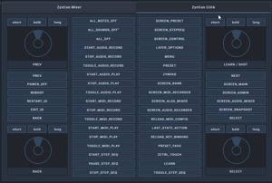

# Zynthian-OSC
Tempate for Open Stage Control with controll of Zynthian synt

For current stable version of ZynthianOS oram is fully working Mixer template only.

## Mixer template


1. edit mixer.js - change "var zyn_host = '192.168.88.102'" to correct address
2. start osc server by this (on raspberry pi):

```
node /path/to/open-stage-control_1.22.0_node 
-s 192.XXX.YYY.ZZZ:1370
-l /path/to/dir/Mixer/mixer_zynthian_oram.json
-c /path/to/dir/Mixer/mixer.js`
--osc-port 1370
```

192.XXX.YYY.ZZZ is address of your Zynthian

## CUIA template


Here is only one json file so you can start osc server by this (on raspberry pi):

```
node /path/to/open-stage-control_1.22.0_node 
-s 192.XXX.YYY.ZZZ:1370
-l /path/to/dir/CUIA/zynthianCUIA.json
--osc-port 1370
```

192.XXX.YYY.ZZZ is address of your Zynthian

## Mixer + CUIA template 





1. edit mixer.js - change "var zyn_host = '192.168.88.102'" to correct address
2. start osc server by this (on raspberry pi):

```
node /path/to/open-stage-control_1.22.0_node 
-s 192.XXX.YYY.ZZZ:1370
-l /path/to/dir/Mixer+CUIA/mixer_CUIA_zynthian.json
-c /path/to/dir/Mixer+CUIA/mixer.js`
--osc-port 1370
```

192.XXX.YYY.ZZZ is address of your Zynthian

# To-Do

## Sooperlooper template

## Sooperlooper + Mixer + CUIAtemplate

Other details are on [Zynthian discourse](https://discourse.zynthian.org/t/zynthian-osc-cuia-over-open-stage-control-template/7217).
